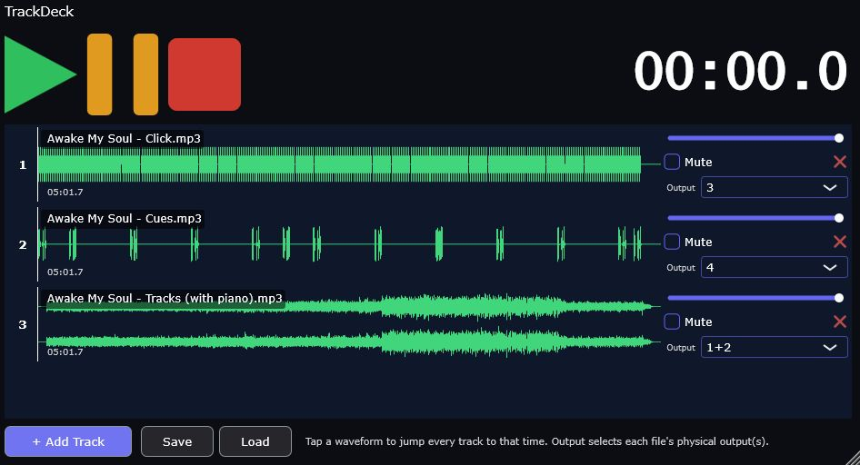

# TrackDeck

TrackDeck is a plugin — available as **VST3**, **AU** (macOS), and **CLAP**,
plus a **standalone app** that needs no DAW at all — for playing multiple
audio files together, perfectly in sync. Built for live performance, where
things need to be big, simple, and reliable, even in a dark room with
seconds to spare between songs.

Load your backing tracks, stems, or cues. Hit play. Everything starts
together, every time.

*AI USED*: Claude Code was used to generate this plugin, and write the README (except for this line). Please let me know if there are errors, omissions, or clarifications required.

## What TrackDeck does

- **Plays multiple tracks in perfect sync.** Load as many files as you need
  (up to 16) and they all start together, sample-accurately, every time you
  hit play.
- **Supports WAV, MP3, and FLAC.**
- **Shows a waveform for every track**, so you can always see where you are.
  Tap anywhere on a waveform to jump the whole set to that point instantly —
  during playback or while stopped.
- **Big, simple transport controls.** Play, Pause, and Stop are large,
  high-contrast buttons designed to be easy to hit with a finger, fast, even
  when the lighting isn't great.
- **Independent volume and mute per track**, so you can balance or drop
  tracks in and out on the fly without losing sync.
- **Flexible output routing.** Send each track to its own output (or, for
  stereo files, its own pair of outputs) so you can route things exactly how
  your setup needs — TrackDeck picks sensible outputs automatically when you
  load a file, and you can change them anytime with a couple of clicks.
- **Starts blank, every time.** A new TrackDeck — standalone or freshly
  added in a host — always opens with no tracks loaded, so you're never
  looking at leftover tracks from something else.
- **Save and load your setup as a file.** Once you've got your tracks,
  volumes, mutes, and output routing the way you want them, save the whole
  thing to a `.tracks` file and load it again anytime — on this machine, on
  another one, or shared with someone else. This is separate from (and
  doesn't interfere with) your DAW's own project save.
- **Resizable window** that adapts to however much space you give it.
- **Looks right on any screen.** Whether you're on a laptop, a high-resolution
  display, or moving the window between monitors with different scaling,
  TrackDeck stays the size it's supposed to be — no shrinking, ballooning,
  or blurry text.

## Plugin formats

TrackDeck works exactly the same way no matter which format you use — pick
whichever one your DAW wants:

- **VST3** — works in most DAWs on Windows, macOS, and Linux. If you're not
  sure which to pick, start here.
- **AU (Audio Unit)** — macOS only. Use this for Logic Pro, GarageBand, or
  any other host that expects AU rather than VST3.
- **CLAP** — a newer, open plugin format. Use this if your DAW supports it
  and you prefer it (Bitwig Studio, REAPER, and FL Studio are a few that do).
- **Standalone** — runs entirely on its own, no DAW required. Handy for
  quick testing, or as your whole setup if you don't need a DAW at all.

## Using TrackDeck

1. Click **+ Add Track** and choose one or more audio files.
2. Hit **Play** — every loaded track starts together.
3. Tap any track's waveform to jump the whole set to that point.
4. Use each track's **volume slider** and **Mute** button to balance your
   mix on the fly.
5. Use the **Output** dropdown on a track to choose which physical output(s)
   it plays through.
6. Click the small **X** to remove a track you no longer need.

A couple of things worth knowing about the transport:

- **Pause** stops playback but keeps your place — press Play again to pick up
  right where you left off.
- **Stop** stops playback and resets everything back to the beginning.

### Saving and loading your setup

TrackDeck always starts blank, so once you've built a set of tracks worth
keeping, save it:

- Click **Save** and choose where to put it. This writes everything — every
  track's file, volume, mute state, and output routing — to a single
  `.tracks` file.
- Click **Load** and pick a `.tracks` file to bring that whole setup back.
  Loading replaces whatever's currently in TrackDeck, so save first if you
  want to keep your current setup around too.

This is entirely separate from your DAW's own project save — using Save and
Load here doesn't change how saving your DAW project works, and saving your
DAW project doesn't touch your `.tracks` files. Use whichever fits: your
DAW's save for "this belongs with this project," or a `.tracks` file for a
setup you want to reuse or share independently of any one project.

---

Want to build TrackDeck yourself, or curious how it works under the hood?
See **[developers.md](developers.md)**.
